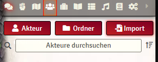
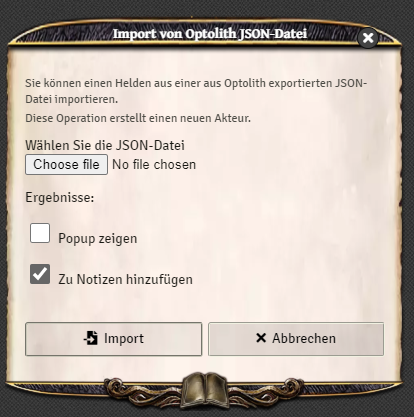

# Optolith to Foundry Importer
:gb: [Auf Englisch](README.md)

Ein Modul für [Foundry Virtual Tabletop](https://foundryvtt.com/) um [Optolith](https://optolith.app/) Charaktäre zu importieren

Vielen Dank an das Optolith-Team für die Übersetzungsdaten!

## Installieren
Benutzt diese URL im Manifest-URL Datenfeld auf der Modul installieren Seite:
```
https://github.com/ntfoster/optolith-to-foundry/releases/latest/download/module.json
```

## Nutzen
Auf dem Akteurverzeichnis-Tab gibt es ein Import Button:



Der Button öffnet eine Dialogbox:



## Problems
Falls Du ein Problem findest, melde es bitte auf Github.
