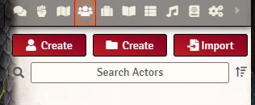
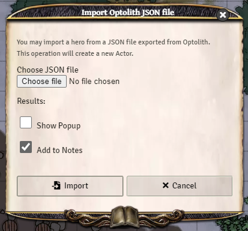
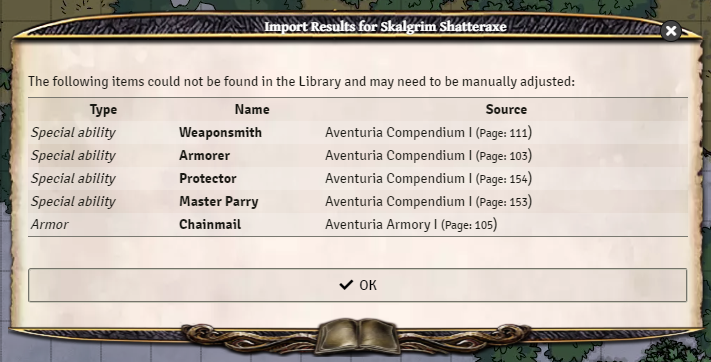

# Optolith to Foundry Importer
:de: [Auf Deutsch](README-de.md)

A module for [Foundry Virtual Tabletop](https://foundryvtt.com/) to import The Dark Eye/Das Schwarze Auge characters from the [Optolith](https://optolith.app/) character creator

This is an early work in progress and there is likely a large number of issues and many feature stills to be implemented. I have not yet tested all possible options in Optolith annd there will be some options that are not supported yet, but the most common ones should hopefully work.

Special thanks to the Optolith developers for the translation data!

Please submit an issue if you find anything which does not work correctly. If you can include a copy of the console log as well that would be very helpful as well (Open console with F12, go to the Console tab, Right click in the console > Save as).

## Installation

You can install this module by using the following URL in the 'Manifest URL' box on the Install Module screen.
```
https://github.com/ntfoster/optolith-to-foundry/releases/latest/download/module.json
```
Remember to activate the module once you have launched a world (Game Settings tab > Manage Modules).

## Usage
If you are logged in as a user with permission to create new Actors, there will be an Import button at the top of the Actors Directory tab. This will open a dialog box for you to upload a JSON file from your computer. Once import is complete, the character sheet for the newly imported Actor will pop up.





Any items (Advantages, Disadvantages, Special Abilities, Spells, Liturgies, and Equipment) that exist in the Library should be imported from there. There will be some exceptions, such as where Optolith and Foundry have slightly different names for the same thing.

Any items that cannot be imported from the Library will instead have a blank item added with the correct name and source book(s) but no other details. These will be noted in the results and will need to be configured manually.

The list of items which were not imported from the Library can be displayed with the following options:
- **Show Popup**: Display the list in a dialog box once the character sheet has been created. Note: this currently sometimes appears *underneath* the character sheet

  E.g. 

- **Add to Notes**: Adds the list to the Notes section of the character sheet.

Note: No matter which options are picked, the list of items which were not imported is output to the console (F12) as an array. Look for the following line followed by an array of items: `Optolith to Foundry Importer | Items that were not found in Library:`

## Rules modules ##
Rules modules are availabe from Ulisses from the [German F-SHOP](https://www.f-shop.de/virtual-tabletops/) and soon to be from the [English F-SHOP](https://www.ulissesf-shop.com/)

## Known issues
- Some items (e.g. Spell Enhancements) haven't been added yet
- If you have more than one version of the same item (e.g. in an offical rules module and a custom module) then only the first one to be found will be added.
- Some items don't have the exact same names in Optolith and Foundry and won't automatically import
- AP Spent is not calculated. You will have to set this manually.
- Some of the German UI translation is currently machine-generated. **Es tut mir leid, mein Deutsch ist nicht so gut!**

## Future plans
- Automatially set values for Mage/Priest Traditions to set correct AE/KP
- Import stats for custom items created in Optolith
- Assign correct category to items not imported from Compendium
- Import avatar image if present in Optolith JSON file
- Import pets/familiars
- Better translation
- Calculate AP Spent correctly
